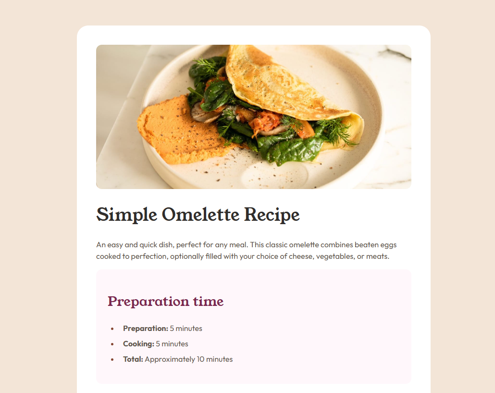

# Frontend Mentor - Recipe page solution

This is a solution to the [Recipe page challenge on Frontend Mentor](https://www.frontendmentor.io/challenges/recipe-page-KiTsR8QQKm). Frontend Mentor challenges help you improve your coding skills by building realistic projects. 

## Table of contents

- [Overview](#overview)
  - [The challenge](#the-challenge)
  - [Screenshot](#screenshot)
  - [Links](#links)
- [My process](#my-process)
  - [Built with](#built-with)
  - [What I learned](#what-i-learned)
  - [Continued development](#continued-development)
  - [AI Collaboration](#ai-collaboration)
- [Author](#author)


## Overview

### Screenshot




### Links

- Live Site URL: [live site here](https://your-live-site-url.com)

## My process

### Built with

- Semantic HTML5 markup
- CSS custom properties
- Flexbox
- Mobile-first workflow

### What I learned

Media Quarys, was the biggers learning moment by far.
but also the fect that I started Working with BAM and nesting in my CSS to make it smarter and more profasional.

a example of a media quary and BAM naming.
```css 
@media (min-width: 48rem) {
    body {
        padding: var(--spacing-128) 0;
    }
    .recipe {
        flex-direction: row;
        max-width: 38.5rem;
        margin: 0 auto;
        padding: var(--spacing-40);
        gap: var(--spacing-40);
        border-radius: var(--radius-md);
    }
    .recipe__intro {
        flex-direction: column;
        align-items: flex-start;
    }
    .recipe__image img {
        border-radius: var(--radius-sm);
    }
    .recipe__section {
        margin: 0;
        gap: var(--spacing-24);
    }
}
  ```


### Continued development

The Above Will need to grow and i'm all for it. The way BAM, Nesting and @media Quarys work baffels me and is realy intersting.
So defently going to look into that more. 


### AI Collaboration

With this assiment the AI was more needed then normal, not that it was riding my code but te explain thing to me, for the questions I had. With Media quarys beeing new to me and working mobile first I needed the help how to set up the correct windows and what to put in there and what not.

## Author

- Website - [Sietse Nijdam](https://www.your-site.com) (still in development)
- Frontend Mentor - [@Mythage](https://www.frontendmentor.io/profile/Mythage)
- LinkedIn - [Sietse Nijdam](https://www.linkedin.com/in/sietse-nijdam-41a39596/)
